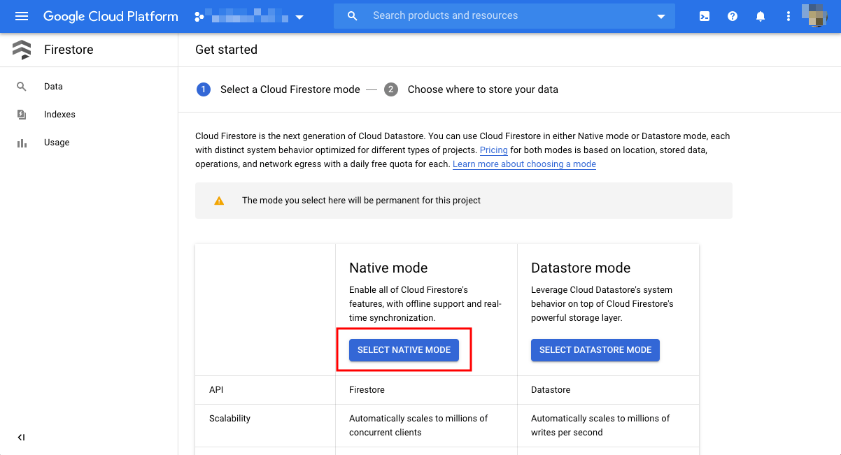
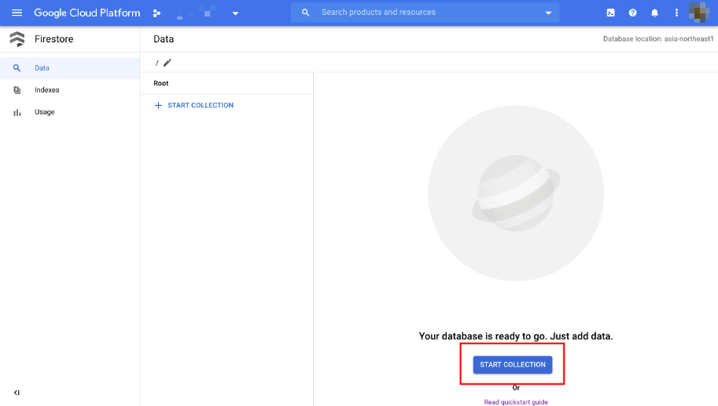
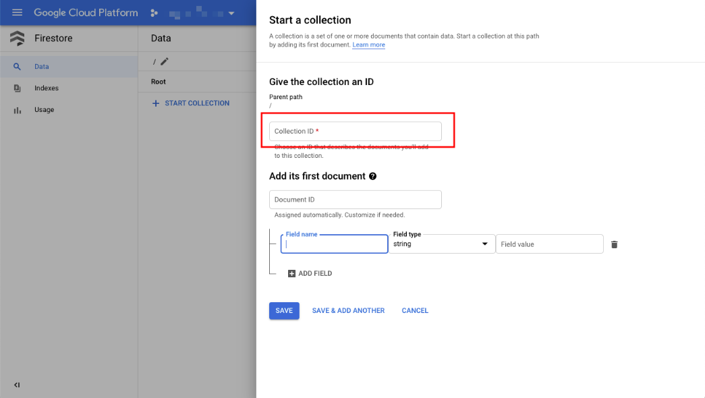
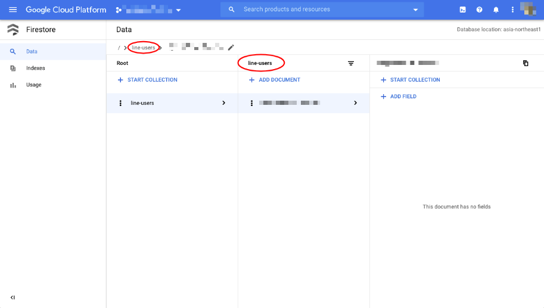
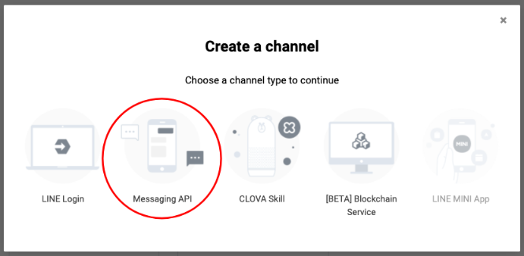
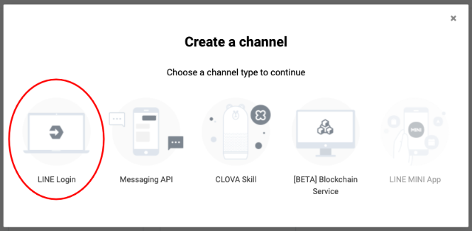
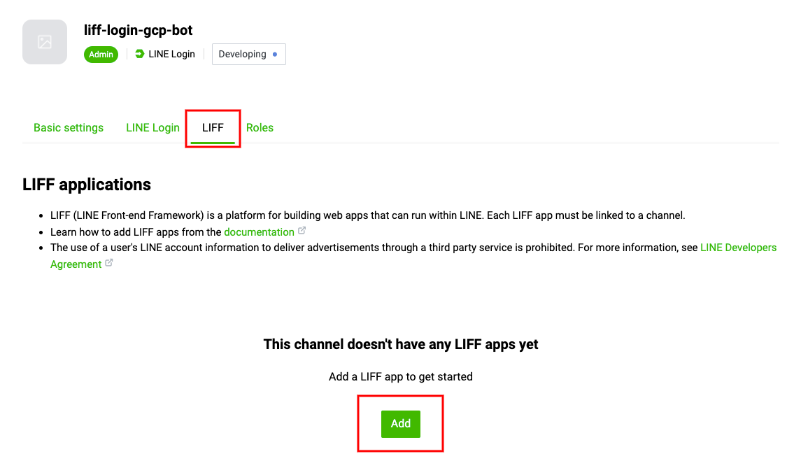
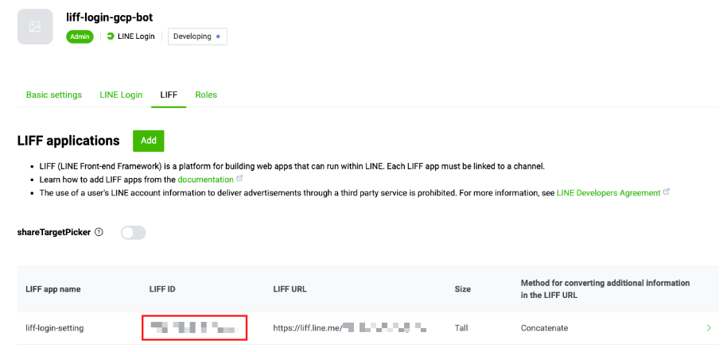

# Recommend bot Using liff

## 準備するもの

+ GCP Project
+ 以下のコマンドが実行できる環境
  + git
    + なるべく最新
  + Python
    + v 3.x
  + gcloud
    + なるべく最新

## 参考ドキュメント

+ Quickstart using a server client library
  + https://cloud.google.com/firestore/docs/quickstart-servers?hl=en#command-line


## 事前に必要なもの

+ LINE Developer にて
  + Provider 作成
    + Messaging API Channel 作成
      + USER_ID
      + YOUR_CHANNEL_SECRET
      + YOUR_CHANNEL_ACCESS_TOKEN
    + LINE Login Channel 作成
      + LIFF_ID
+ GCP
  + 任意のプロジェクト作成

## GCP を操作するための準備をする

+ GCP の認証をする

```
gcloud auth login -q
```

+ gcloud コマンドの設定を行う

```
export _pj_id='Your GCP Project ID'
export _rg='asia-northeast1'
export _zn='asia-northeast1-c'

gcloud config set project ${_pj_id}
gcloud config set compute/region ${_rg}
```

+ GCP Project 内で各コンポーネントの API を有効化する

```
gcloud beta services enable cloudbuild.googleapis.com && \
gcloud beta services enable appengine.googleapis.com && \
gcloud beta services enable firestore.googleapis.com && \
gcloud beta services enable storage.googleapis.com && \
gcloud beta services enable storage-component.googleapis.com
```

## ソースコードを取得する

+ 自分のワークスペースにて、このレポジトリを clone する

```
git clone https://github.com/line-bot-gcp/recommend-bot-using-liff.git
cd recommend-bot-using-liff
```

## GCS に画像をアップロードする

+ bucket の作成

```
gsutil mb gs://${_pj_id}-recommend-bot-using-liff
gsutil ls | grep ${_pj_id}-recommend-bot-using-liff
```

+ GCS にイメージファイルをコピー

```
gsutil cp static/images/*.png gs://${_pj_id}-recommend-bot-using-liff/
gsutil ls gs://${_pj_id}-recommend-bot-using-liff
```

+ GCS にアップロードしたイメージを一般公開する

```
gsutil iam ch allUsers:objectViewer gs://${_pj_id}-recommend-bot-using-liff
```

## App Engine のダミーをデプロイする

+ ダミーの App Engine のディレクトリに移動

```
cd app-engine-dummy
```

+ App Engine をデプロイする

```
gcloud app deploy
```

+ App Engine の URL を確認する
  + 出てきた `https://hogehoge.zppspot.com` をコピーしておく

```
gcloud app browse
```

```
### Ex.

# gcloud app browse
Did not detect your browser. Go to this link to view your app:
https://hogehoge.an.r.appspot.com
```

+ root ディレクトリに戻る

```
cd -
```

## Firestore を準備する

GCP コンソールの FireStore に行き、 `Native mode` を選択



リージョンは `asia-northeast1` を選択


`line-users` という Collection ID を作る





## LINE Developer の設定を行う

### LINE Developer にて Messaging API を作る

Messaging API の作成



Key | Value
:- | :-
Channel name | liff-api-gcp-bot
Channel descriptionl | liff-api-gcp-bot
Category | どれでも
Subcategory | どれでも
Email address | あなたの Email

token などを取得

+ `Basic settings` タブにて
  + `Channel secret` を取得
  + `Your user ID` を取得
+ `Messaging API` タブにて
  + `Channel access token` を取得
  + `Webhook URL` に `${App Engine の URL}/callback` を入力
  + `Use webhook` を on にする

### LINE Login を作る



Key | Value
:- | :-
Channel name | liff-login-gcp-bot
Channel descriptionl | liff-api-gcp-bot
App types | ✔ Web app <br>✔ Mobile app
Email address | あなたの Email

### LINE Login の中で LIFF を設定する



Key | Value
:- | :-
LIFF app name | liff-login-setting
Size | Tall
Endpoint URL | App Engine の URL (Ex. https://hogehoge.appspot.com)
Scopes | ✔ profile <br>✔ openid<br>✔ chat_message.write
Bot link feature | On(Nomal)
Scan QR | 無し

### LIFF ID を確認する



## App Engine をデプロイする

+ app.yaml を作る
  + :warning: Channel access token だけは特殊文字が入るため、自分で後ほど入れる

```
export _UID="Your user ID"
export _YR_CH_SCR="Your Channel secret"
export _YR_CH_ACC_TKN="Your Channel access token"
export _YR_BCK=${_pj_id}-recommend-bot-using-liff
```

+ template yaml から app を作る
  + :warning: Channel access token だけは特殊文字が入るため、自分で後ほど入れる

```
cat app.yaml.template | sed "s/_uid/${_UID}/g" | sed "s/_yr_ch_scr/${_YR_CH_SCR}/g" | sed "s/_LIFF_ID/${_liff_id}/g" | sed "s/_liff_id/${_LIFF_ID}/g" | sed "s/_yr_bck/${_YR_BCK}/g" > app.yaml
```

+ 作成した app.yaml に Channel access token を Vim で入れる

```
vim app.yaml


=====================

YOUR_CHANNEL_ACCESS_TOKEN: ""  <----- ここにいれる
```

+ liff-starter.js.template から作る

```
cat static/js/liff-starter.js.template | sed "s/_liff_id/${_LIFF_ID}/g" > static/js/liff-starter.js
```

+ 改めて、App Engine にデプロイ
  + 最初にデプロイしたダミーは上書きされるので :ok:

```
gcloud app deploy
```

## 確認

WIP


